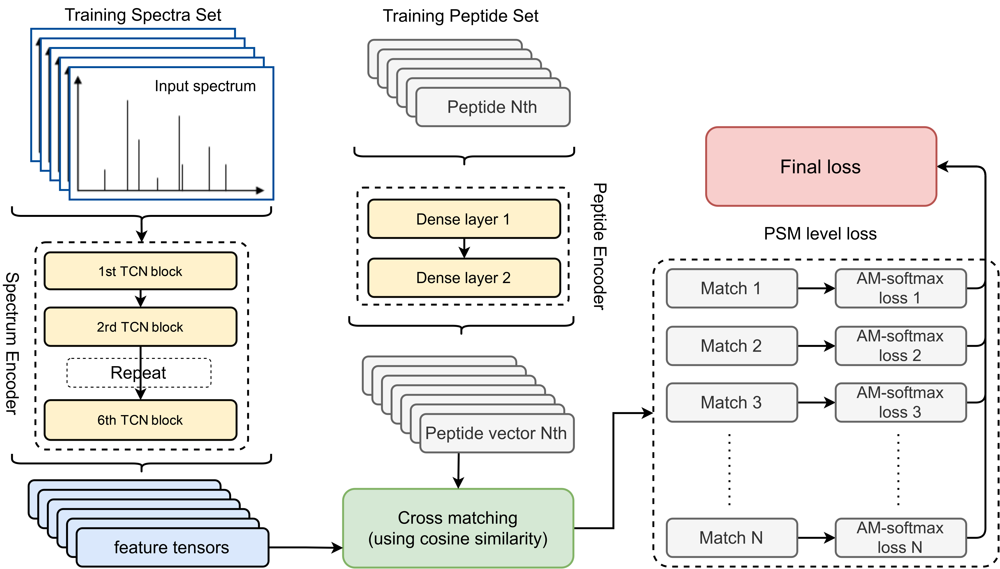
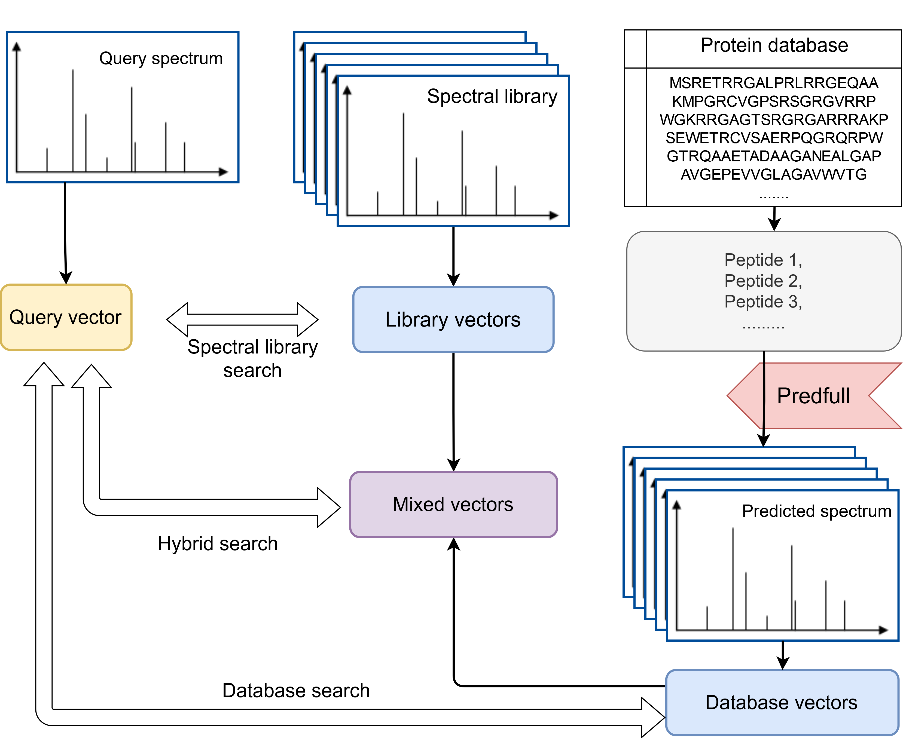

# SpecEncoder

Source code for SpecEncoder: Deep Metric Learning for Accurate Peptide Identification in Proteomics

# __DONT USE FOR NOW, CODE MIXUP DUE TO GIT ERROR, WILL FIX SOON__

Free for academic uses. Licensed under LGPL.

__Visit [https://predfull.com/](https://predfull.com/) to check related works__

## Update History

* 2024.03.07: Second version.
* 2023.10.28: First version.

## Method

Based on the structure of the residual convolutional networks.

Different workflows:

### Required Packages

Recommend to install dependency via [Anaconda](https://www.anaconda.com/distribution/)

* Python >= 3.7
* Tensorflow >= 2.5.0
* Pandas >= 0.20
* pyteomics
* numba
* Tensorflow-addons

### Usage

__After clone this project, you should download the pre-trained model (`encoder.h5`) from [zenodo.org](https://zenodo.org/record/789847) and place it into SpecEncoder's folder.__

Frist we convert query and database into vectors:

`python encode.py --query query.mgf --model model.h5 --output query.npy`

`python encode.py --query database.mgf --model model.h5 --output database.npy`

Then we can perform searching:

`python search.py --query query.npy --db database.npy --output result.tsv`

Typical running speed: convert around 700 spectra in 1 second on a NVIDIA A6000 GPU.

## Train this model

See `train.py` for sample training codes
